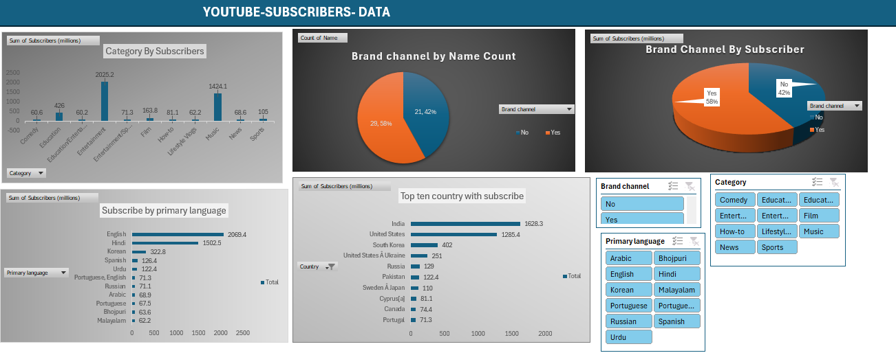

# Data Analytics Project

# Project 1

**Title:** [COOKIE COMPANY FINANCIAL](https://github.com/Darlingtonobus/Github.io-Darlingtonobus/blob/main/Cookie%20Company%20Financials.xlsx)

**Tools Used:** Microsoft Excel, Pivot chart, power query

**Project Description:**

**Key findings:**

**Dashboard Overview:**

# Project 2

**Title:** [Youtube Subscriber Data](https://github.com/Darlingtonobus/Github.io-Darlingtonobus/blob/main/youtube_subscribers_data.csv)

**Tools Used:** Microsoft Excel, Pivot chart, power query

**Project Description:**

**Key findings:**

**Dashboard Overview:**

# Project 3

**Title:** Workplace Safety Data Sql Extraction

**SQL Code:** [Workplace safety data-Sql interrogation](https://github.com/Darlingtonobus/Github.io-Darlingtonobus/blob/main/Workplacesafetydata.Sql)

**SQL Skills Used:** 

**Data Retrieval (SELECT):** Queried and extracted specific information from the database.

**Data Aggregation (SUM, COUNT):** Calculated totals, such as sales and quantities, and counted records to analyze data trends.

**Data Filtering (WHERE, BETWEEN, IN, AND):** Applied filters to select relevant data, including filtering by ranges and lists.

**Data Source Specification (FROM):** Specified the tables used as data sources for retrieva

**Project Description:**

**Technology used: SQL server**
