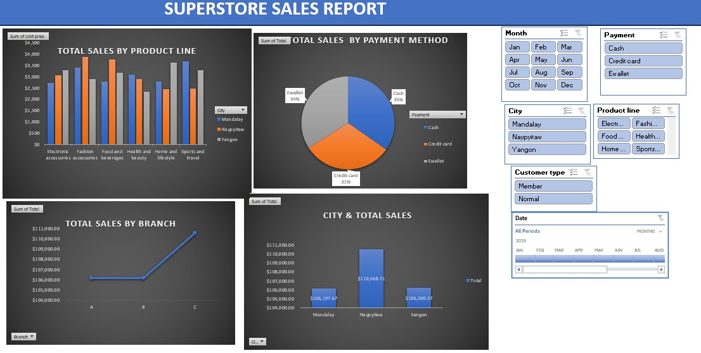

# Data Analytics Project

# Project 1

**Title:** [Superstore sales Data](https://github.com/Darlingtonobus/Github.io-Darlingtonobus/blob/main/SUPERSTORE%20SALES%20(1).xlsx)

**Tool used:** Microsoft excel ( tool used)

**Project  Description:**

**Key finding:**

**Dashboard Overview:**

# Project 2

**Title:** Employee info extraction

**SQL Code:**[ employeeinfo-sql interogation](https://github.com/Darlingtonobus/Github.io-Darlingtonobus/blob/main/EmployeeInfo.Sql)

**SQL Skills Used:**

Data Retrieval (SELECT): Queried and extracted specific information from the database.

Data Aggregation (SUM, COUNT): Calculated totals, such as sales and quantities, and counted records to analyze data trends.

Data Filtering (WHERE, BETWEEN, IN, AND): Applied filters to select relevant data, including filtering by ranges and lists.

Data Source Specification (FROM): Specified the tables used as data sources for retrieval

**Project Description:**

**Technology used: SQL server**
