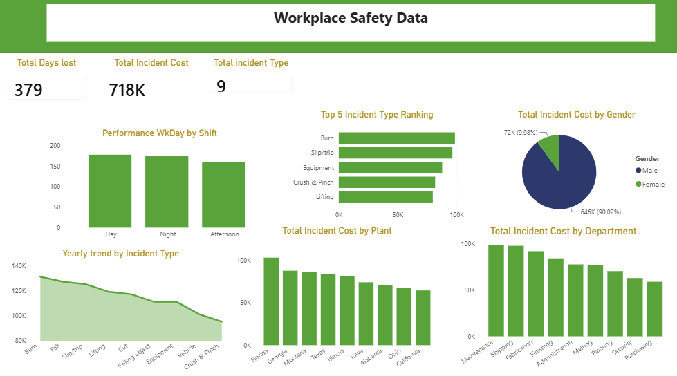
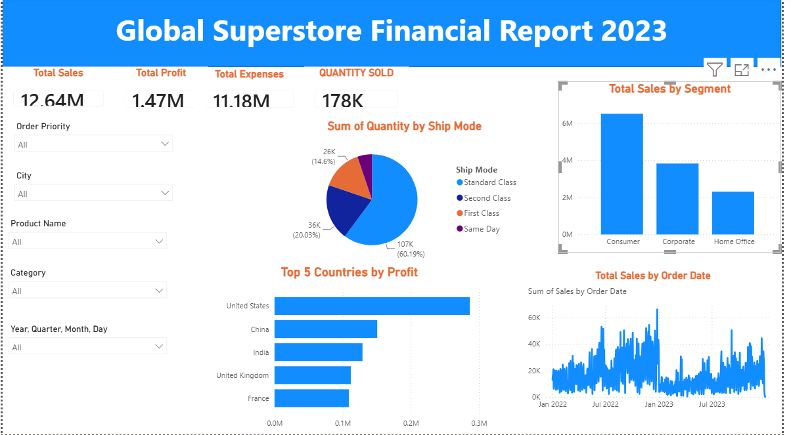

# Data Analytics Project

# Project 1

**Title:** [COOKIE COMPANY FINANCIAL](https://github.com/Darlingtonobus/Github.io-Darlingtonobus/blob/main/Cookie%20Company%20Financials.xlsx)

**Tools Used:** Microsoft Excel, Pivot chart, power query

**Project Description:** This project involved analysing product data of cookies company to identify trends and patterns in sales in  performance for 2020. It is designed to provide a comprehensive overview of key performance metrics. This dashboard allows stakeholders to easily monitor and analyze the company’s performance across different regions, products, and time periods. The dashboard includes the following features:

**Key findings:**
Total Revenue by Country: Highlights the total revenue generated in each country, showcasing the performance in different markets.
Additionally, the dashboard includes interactive slicers and timeline for:

Profit by Country : Visual representation of profits broken down by each country.

 Monthly income revenue: A monthly breakdown of the total revenue providing insights into sales trends over time.

 Total cost by product : Visual representation of total cost  broken down by each product type.

**Dashboard Overview:**
.png)

# Project 2

**Title:** [Youtube Subscriber Data](https://github.com/Darlingtonobus/Github.io-Darlingtonobus/blob/main/youtube_subscribers_data.csv)

**Tools Used:** Microsoft Excel, Pivot chart, power query 

**Project Description:** This project analyzes YouTube channel subscriber data to identify trends in subscriber growth across categories, countries, languages, and brand channels. The data was cleaned using Power Query and transformed into an interactive Excel dashboard to help understand audience distribution and channel performance.

**Key findings:**  Music was the category with the highest number of subscribers.
         * India and the United States had the largest subscriber base.
         * English was the dominant language among YouTube channels.
         * Branded channels accounted for a larger share of total subscribers.
         * Entertainment and Music consistently attracted the highest audience.

**Dashboard Overview:**

# Project 3

**Title:** [Workplace Safety Data](https://github.com/Darlingtonobus/Github.io-Darlingtonobus/blob/main/Workplace%20Safety%20Data.xlsx)

**Tools Used:**  Power Query,  Power BI Desktop, DAX, Data Modelling

**Project Description:** This project analyzes workplace safety incident data to identify trends, high-risk areas, and factors contributing to workplace incidents. The dashboard provides management with actionable insights into incident costs, lost workdays, departments, plants, and incident types, supporting data-driven decisions to improve workplace safety and reduce operational risks

**Key findings:** *Burn injuries were the most frequent workplace incident.
* Maintenance and Shipping departments recorded the highest incident costs.
* Florida reported the highest total incident cost among all plants.
* Day and night shifts experienced more incidents than afternoon shifts.
* Male employees accounted for the majority of incident-related costs.
* Total incident costs exceeded £718K, with 379 lost workdays recorded.

**Dashboard Overview:**

# Project 4

**Title:** [Global Superstore Financial Report 2023](https://github.com/Darlingtonobus/Github.io-Darlingtonobus/blob/main/Global%20Superstore%20Data%202023.xlsx)

**Tools Used:**  Power Query, Power BI Desktop,  DAX, Data Modelling

**Project Description:** This project analyzes the financial performance of a global retail business using sales, profit, expenses, and order data. The dashboard provides decision-makers with an interactive view of business performance across customer segments, countries, products, and shipping methods, helping identify profitability trends and opportunities for growth.

**Key findings:** The business generated £12.64M in total sales and £1.47M in profit.
* Consumer customers contributed the highest share of total sales.
* Standard Class was the most frequently used shipping method.
* The United States generated the highest profit among all countries.
* Sales fluctuated throughout the year, with noticeable peak periods that may reflect seasonal demand.

**Dashboard Overview:**

# Project 5

**Title:** Employee Info  Data Extraction

**SQL Code:** [Employee Info Data interrogation](https://github.com/Darlingtonobus/Github.io-Darlingtonobus/blob/main/EmployeeInfoData.Sql)

**SQL Skills Used:** 

**Data Retrieval (SELECT):** Queried and extracted specific information from the database.

**Data Aggregation (SUM, COUNT):** Calculated totals, such as sales and quantities, and counted records to analyze data trends.

**Data Filtering (WHERE, BETWEEN, IN, AND):** Applied filters to select relevant data, including filtering by ranges and lists.

**Data Source Specification (FROM):** Specified the tables used as data sources for retrieva

**Project Description:**

**Technology used: SQL server**

# Project 6

**Title:** Workplace Safety Data Sql Extraction

**SQL Code:** [Workplace safety data-Sql interrogation](https://github.com/Darlingtonobus/Github.io-Darlingtonobus/blob/main/Workplacesafetydata.Sql)

**SQL Skills Used:** 

**Data Retrieval (SELECT):** Queried and extracted specific information from the database.

**Data Aggregation (SUM, COUNT):** Calculated totals, such as sales and quantities, and counted records to analyze data trends.

**Data Filtering (WHERE, BETWEEN, IN, AND):** Applied filters to select relevant data, including filtering by ranges and lists.

**Data Source Specification (FROM):** Specified the tables used as data sources for retrieva

**Project Description:**

**Technology used: SQL server**
